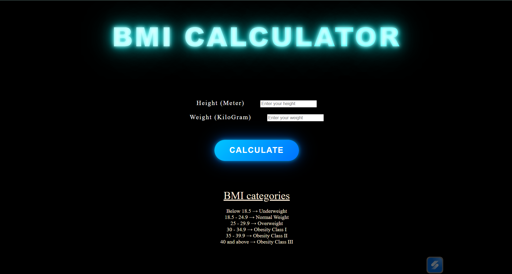

# BMI Generator

A simple and interactive BMI Generator built using **HTML, CSS, and JavaScript**.  
This project calculates Body Mass Index (BMI) based on height and weight and instantly shows the health category with a clean and responsive user interface.

---

## Features

- Calculate BMI instantly
- Responsive UI
- Simple and clean design
- Shows BMI categories
- Beginner-friendly JavaScript project

---

## Tech Stack

- HTML5
- CSS3
- JavaScript

---

## Live Demo

🔗 [Live Demo](bmi-generator-fx87uqqhk-rohit12412021s-projects.vercel.app)

---

## Screenshot



---

## BMI Categories

| BMI Range | Category |
|---|---|
| Below 18.5 | Underweight |
| 18.5 - 24.9 | Normal Weight |
| 25 - 29.9 | Overweight |
| 30+ | Obese |

---

## How to Run Locally

```bash
git clone https://github.com/your-username/bmi-generator.git
```

Open `index.html` in your browser.

---

## Author

Rohit Yadav

GitHub: [@your-github-username](https://github.com/Rohit12412021)